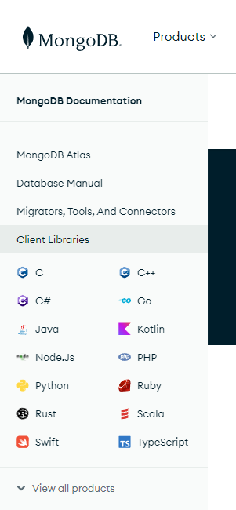

# Shell vs Drivers

https://www.mongodb.com/

https://www.mongodb.com/docs/

On the Doc page, click on Drivers.

Drivers for all kinds of languages down the left side



Look at Nodejs Python for example

Node https://www.mongodb.com/docs/drivers/node/current/quick-start/
* insertMany example

Python: https://www.mongodb.com/docs/drivers/python-drivers/
* pymongo the official driver
* connect and so on

```py
from pymongo.mongo_client import MongoClient
from pymongo.server_api import ServerApi

# Replace the placeholder with your Atlas connection string
uri = "<connection string>"

# Set the Stable API version when creating a new client
client = MongoClient(uri, server_api=ServerApi('1'))
                          
# Send a ping to confirm a successful connection
try:
    client.admin.command('ping')
    print("Pinged your deployment. You successfully connected to MongoDB!")
except Exception as e:
    print(e)
```

We will see a full Node application later in this course

Lots of drivers to be really flexible in what we build
