# Installing MongoDB on Windows

Download: https://www.mongodb.com/try/download/community

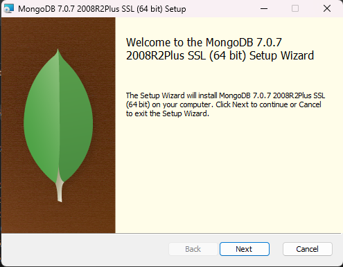

Hit Next

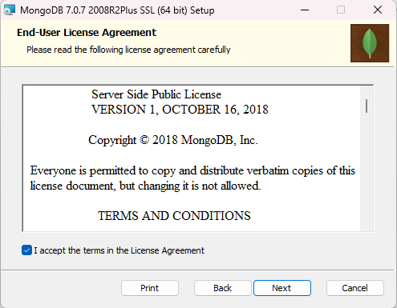

I accept should checked. Hit Next.

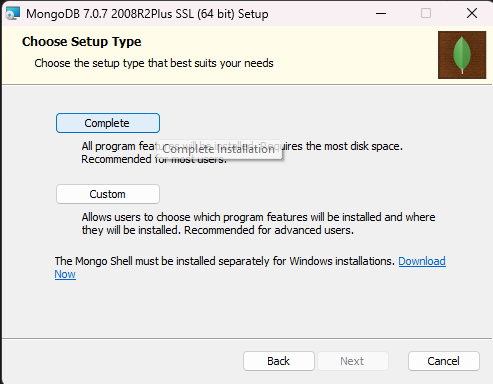

Hit Complete

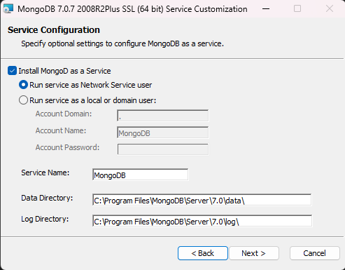

Install MongoD as a Service checkbox
* Windows will automatically boot the MongoDB server
* We will keep this checked

Data and Log Directory
* Mongo manages data
* The data path "C:\Program Files\MongoDB\Server\7.0\data\" will be were the concrete DB will be written by default.
* Similar with logs "C:\Program Files\MongoDB\Server\7.0\log\"

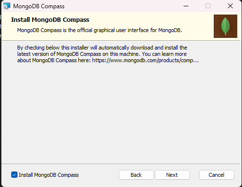

MongoDB checkbox can be set and it will give you the GUI at the same time.

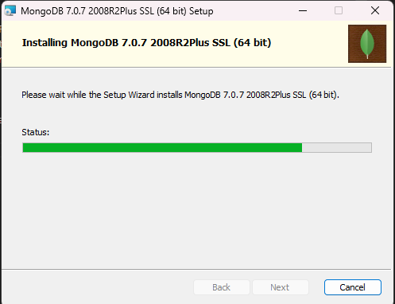

Approve with Admin privledges. Wait for it to install.
* Compass will take an additional few mins.

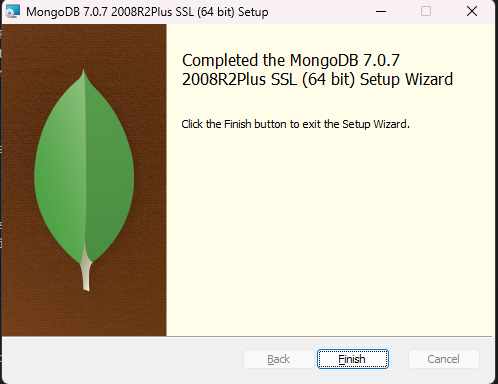

View this new service in Windows "Services" menu

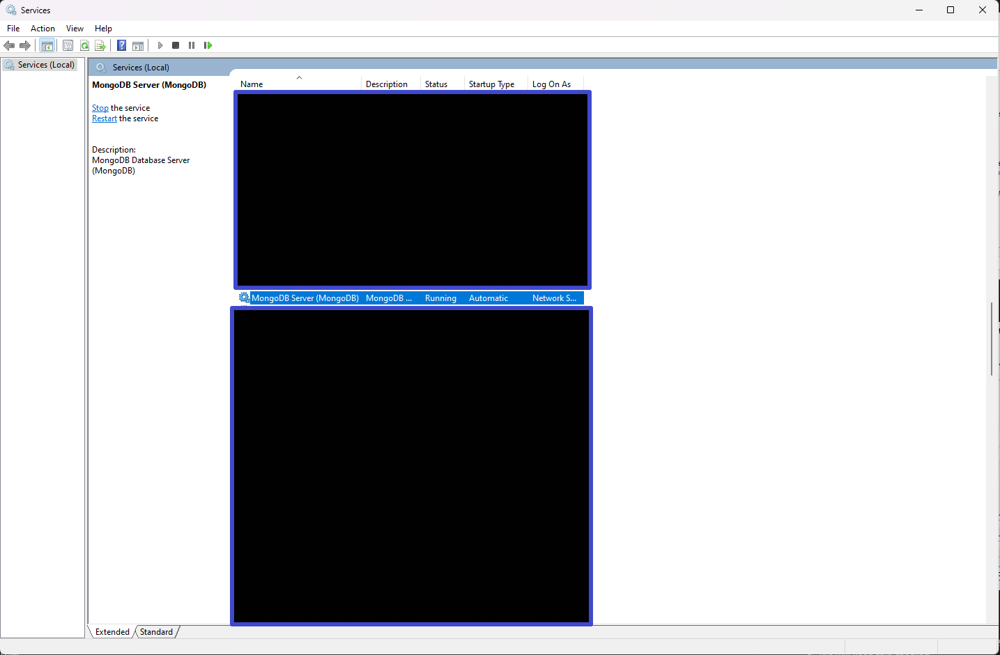

From here you can right click start/stop whenever, but on system boot it will start automagically.

## CMD start stop

`net stop MongoDB` to stop Mongo
* Must be run in Admin mode cmdline

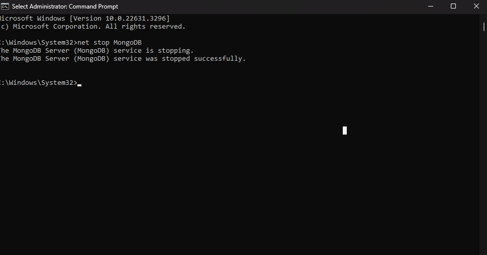

`net start MongoDB` to start Mongo again

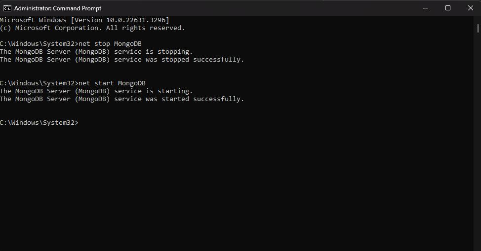

Can use the services tool in Windows or the command line

We need to know the client. Go to where the server was installed.

From here the instructor double clicks on mongo.exe. I don't have this and it looks like he is sitting on 5.0 whereas I am on 7.0.

For me I had to install mongosh separately.

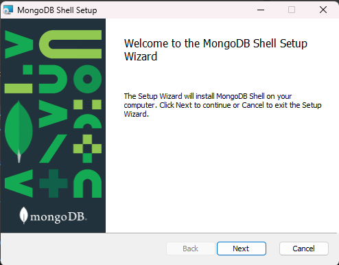

Hit Next

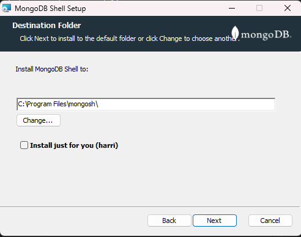

Uncheck the isntall just for you so its given PC wide. Hit Next "C:\Program Files\mongosh\"

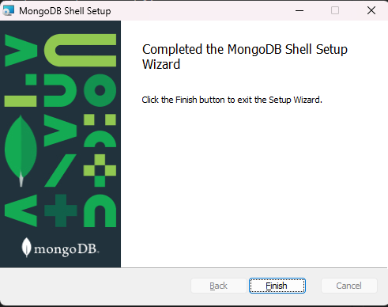

Hit Finish

Now go to the install location "C:\Program Files\mongosh\""

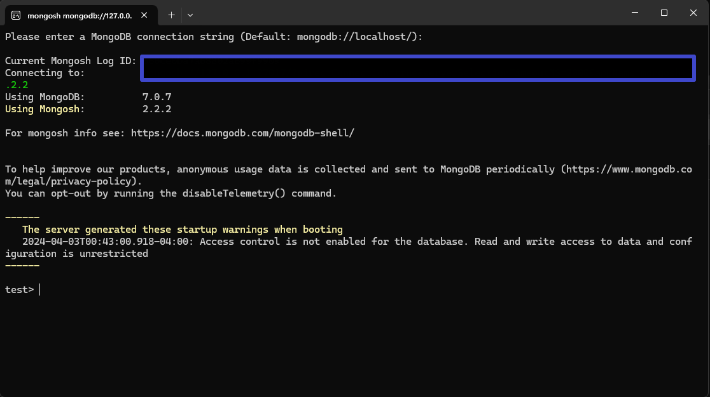

Now use a basic command to view DB stats

`show dbs`

```
admin   0.000GB
config  0.000GB
local   0.000GB
```

Example output

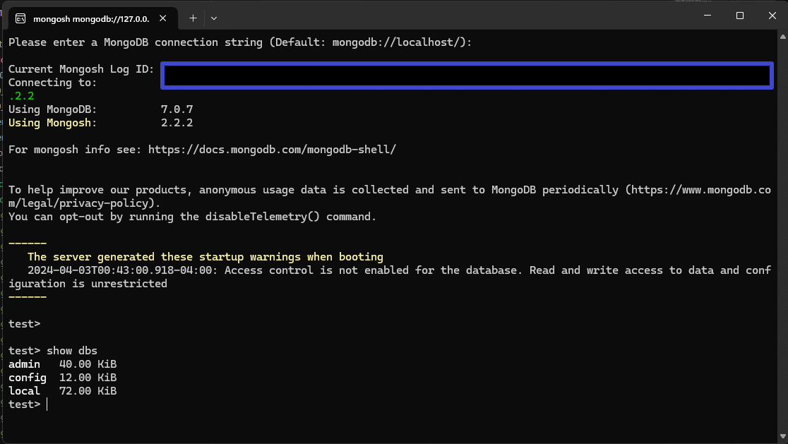

That's all for now but we will use this more later!
