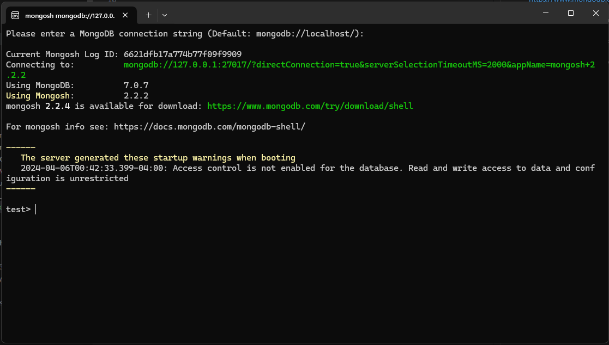
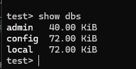

# Installing the MongoDB Shell

You already should have the mongo shell or "mongosh"

I have already installed this in the previous lecture.

The appearance will be difference but all the commands are the same

https://www.mongodb.com/try/download/shell

Recommend going with the MSI

This lecture also displays how to do this on MAC
* Move the mongosh and mongocryptd-mongosh to .../local/bin

Just as before you can run "show dbs"

